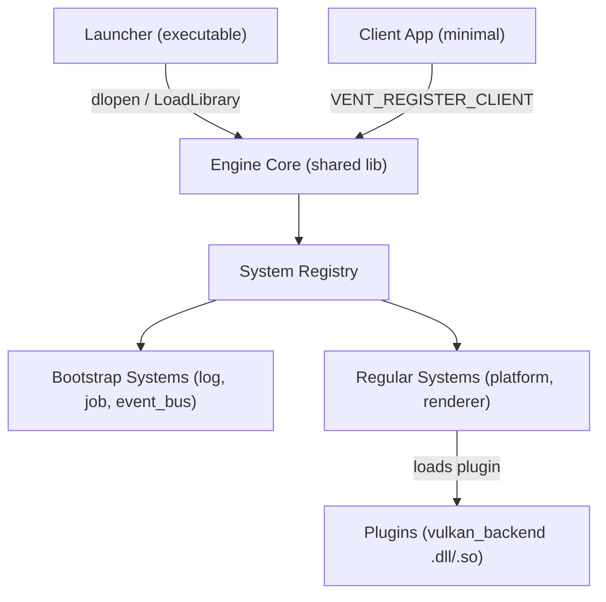

# Vent Engine — Deep Codebase Analysis & Vulkan Audit

## Table of Contents
1. [Architecture Overview](#architecture-overview)
2. [General Codebase Issues](#general-codebase-issues)
3. [Vulkan Renderer — Deep Dive & Comparison](#vulkan-renderer--deep-dive--comparison)
4. [Severity Summary](#severity-summary)

---

## Architecture Overview

The codebase is a modular game engine ("vent") with a clean layered architecture:



**Positive observations before the critique:**
- Very clean code style, consistent formatting, good commenting discipline
- Well-structured module/plugin separation with clear public/private/src convention
- Good use of C++20/23 features (designated initializers, `std::ranges`, `std::format`, concepts)
- RAII used throughout (vulkan-hpp RAII, unique_ptr, lock_guard)
- Proper use of `[[nodiscard]]`, `VENT_NO_COPY_MOVE`, trailing return types
- Event-driven dependency resolution during initialization is elegant
- The job system interface with type-erased `submit<F>()` is well designed

---

## General Codebase Issues

### 🔴 Critical

#### 1. Duplicate File: `system_initialization_result.hpp` vs `system_initialization_result.hpp`

[system_initialization_result.hpp](file:///c:/dev/vent/vent_engine/_vent/system/system_initialization_result.hpp) and [system_initialization_result.hpp](file:///c:/dev/vent/vent_engine/_vent/system/system_initialization_result.hpp) are **nearly identical files** with different struct names (`system_initialization_result` vs `system_initialization_result`). Only `system_initialization_result` is used anywhere. The second file is dead code that will confuse future developers.

#### 2. `VENT_NO_MOVE` Macro is Wrong

In [vent_sdk.hpp L82-84](file:///c:/dev/vent/vent_engine/_vent/vent_sdk.hpp#L82-L84):
```cpp
#define VENT_NO_MOVE(class_name)                        \
    class_name(const class_name&&)            = delete; \
    class_name& operator=(const class_name&&) = delete;
```
The move constructor/assignment take `const T&&`, not `T&&`. `const T&&` is a **very unusual** type that almost never matches in practice. The correct form should be:
```cpp
    class_name(class_name&&)            = delete;
    class_name& operator=(class_name&&) = delete;
```
This means **no class using `VENT_NO_COPY_MOVE` actually has its move operations deleted**. They all silently fall back to being non-movable only because the copy-delete implicitly prevents move generation — but **only** because of the Rule of Five. If someone later adds a move constructor explicitly, the macro won't protect against it.

#### 3. Event Bus `_publish_count_after_cleanup` Data Race

In [event_bus.cpp L133-136](file:///c:/dev/vent/vent_engine/modules/core/src/event_bus.cpp#L133-L136):
```cpp
_publish_count_after_cleanup++;
if (_publish_count_after_cleanup >= _cleanup_interval) {
    cleanup_invalid_subscriptions();
}
```
`_publish_count_after_cleanup` is incremented **without any lock or atomic** from `dispatch()` which runs on multiple job threads concurrently. This is a **data race** (undefined behavior per C++ standard). The same issue exists in `dispatch_wait()`.

#### 4. `_window_sub` and `_window_destroyed_sub` Uninitialized

In [renderer.hpp L74-75](file:///c:/dev/vent/vent_engine/modules/renderer/private/renderer.hpp#L74-L75):
```cpp
subscription_id         _window_sub;
subscription_id _window_destroyed_sub;
```
These are not initialized to `INVALID_SUBSCRIPTION` (0). If `shutdown()` is called before `initialize()` completes, or if `initialize()` fails early, the `shutdown()` method will attempt to `unsubscribe()` with a garbage ID.

---

### 🟡 Moderate

#### 5. `TIC`/`TOC` Macros in a Public SDK Header

In [vent_sdk.hpp L95-108](file:///c:/dev/vent/vent_engine/_vent/vent_sdk.hpp#L95-L108), the `TIC`/`TOC` profiling macros:
- Include `<chrono>` and `<print>` in every translation unit that includes the SDK
- Pollute the global scope with `__vent_tic` (double-underscore names are **reserved by the C++ standard** for the implementation)
- Are left on permanently (no `#ifdef` guard for debug/release)
- The `TOC` macro uses `std::print` which may not be available everywhere

#### 6. `CACHE_LINE` Hardcoded to 64

In [vent_sdk.hpp L140](file:///c:/dev/vent/vent_engine/_vent/vent_sdk.hpp#L140):
```cpp
constexpr auto CACHE_LINE = 64u;
```
The comment itself acknowledges this is a hack. Modern C++17 provides `std::hardware_destructive_interference_size` which is portable. Apple Silicon (M-series) uses 128-byte cache lines, so this will silently cause false sharing on macOS.

#### 7. `ic_log` Massive Code Duplication

[ic_log.hpp](file:///c:/dev/vent/vent_engine/_vent/interfaces/ic_log.hpp) has 12 nearly identical template methods (6 for short format, 6 for full format). They all duplicate the same `buffer[4096]` + `format_to_n` + null-terminate pattern. This could be a single private helper with the log level as a parameter. The `4096` buffer on the stack is also risky for deeply recursive call stacks.

#### 8. `system_registry::get_interface_ptr` Uses Type Name String Comparison

In [system_registry.cpp L286](file:///c:/dev/vent/vent_engine/modules/core/src/system_registry.cpp#L286):
```cpp
if (std::string_view(type_idx.name()) == interface_type.name() || 
    type_idx == std::type_index(interface_type))
```
The `type_info::name()` string comparison is a hack to work around cross-DLL `type_info` identity issues on Windows. It's technically fragile — `name()` is implementation-defined and not guaranteed unique across different types. The proper solution is to use string-based interface IDs or a custom RTTI system.

#### 9. `platform_type` Comments Are Unprofessional

In [ic_platform.hpp L18-24](file:///c:/dev/vent/vent_engine/_vent/interfaces/ic_platform.hpp#L18-L24):
```cpp
unknown = 0,  ///< you'll die if this happens.
x11     = 1,  ///< good linux.
wayland = 2,  ///< broken linux.
win32   = 3,  ///< ai slop.
cocoa   = 4,  ///< heiße schokolade (macos).
```
These comments are in a **public SDK header** that clients include. They should be professional.

#### 10. `system_registry` Uses `std::unordered_map` Without Proper Locking

The `_systems` map in `system_registry` is accessed from job threads during initialization (via `mark_system_ready`, `get_entry`) but also from the main thread during `shutdown_all` and `cache_role_interfaces`. There's `_init_order_mutex` but no general mutex protecting `_systems` itself. The system works only because of the current carefully-sequenced flow, but it's fragile.

#### 11. `vulkan_backend` Present Queue Family is a Global Singleton

In [vulkan_backend.hpp L65](file:///c:/dev/vent/vent_engine/plugins/vulkan_backend/private/vulkan_backend.hpp#L65):
```cpp
u32 _present_queue_family  = 0;
```
And in [vulkan_backend.cpp L575](file:///c:/dev/vent/vent_engine/plugins/vulkan_backend/src/vulkan_backend.cpp#L575):
```cpp
_present_queue_family = i;
```
The present queue family is a **single member variable** that gets overwritten every time `create_surface()` is called. If two windows have different present queue family requirements, the second call silently clobbers the first. The present family should be per-surface, which it is (passed to `vulkan_swapchain`), but the backend's own `_present_queue` becomes stale.

#### 12. Typo in Comment

[vulkan_backend.cpp L668](file:///c:/dev/vent/vent_engine/plugins/vulkan_backend/src/vulkan_backend.cpp#L668):
```cpp
// --- system registratiob ---
```
Should be "registration".

---

### 🟢 Minor / Style

#### 13. `reinterpret_cast` for X11 Window Handle
In [vulkan_backend.cpp L514](file:///c:/dev/vent/vent_engine/plugins/vulkan_backend/src/vulkan_backend.cpp#L514):
```cpp
ci.window = reinterpret_cast<::Window>(native_handle);
```
This works on current platforms where `Window` (X11) is an unsigned long, but it's a `void*` → integer conversion via `reinterpret_cast`. This is implementation-defined behavior and could break on platforms where `sizeof(void*) != sizeof(Window)`.

#### 14. Missing macOS / Cocoa Surface Creation
In [vulkan_backend.cpp L530-534](file:///c:/dev/vent/vent_engine/plugins/vulkan_backend/src/vulkan_backend.cpp#L530-L534), macOS/Cocoa is listed in the extensions (line 187) but has no corresponding case in `create_surface_for_window()`. Creating a surface for a cocoa window will fall through to the `default:` error case.

#### 15. `(void) type;` in Debug Callback
In [vulkan_backend.cpp L55](file:///c:/dev/vent/vent_engine/plugins/vulkan_backend/src/vulkan_backend.cpp#L55), the `type` parameter is explicitly silenced. The message type (general/validation/performance) is useful information that should be included in the log output.

---

## Vulkan Renderer — Deep Dive & Comparison

### What You're Doing vs. What Tutorials/Official Guides Recommend

The Vulkan code uses **vulkan-hpp RAII** (`vk::raii::*`) with dynamic dispatch, which is already significantly more advanced and modern than most tutorials (which use the raw C API). Here's a detailed comparison:

---

### 🔴 Critical Vulkan Issues

#### V1. `_render_finished_semaphores` Indexed by `_current_image_index` — Synchronization Bug

This is the **most serious bug** in the Vulkan code.

In [vulkan_swapchain.cpp L128-129](file:///c:/dev/vent/vent_engine/plugins/vulkan_backend/src/vulkan_swapchain.cpp#L128-L129) (end_frame submit):
```cpp
.pSignalSemaphores = &(*_render_finished_semaphores[_current_image_index])
```

And in [vulkan_swapchain.cpp L136-137](file:///c:/dev/vent/vent_engine/plugins/vulkan_backend/src/vulkan_swapchain.cpp#L136-L137) (present):
```cpp
.pWaitSemaphores = &(*_render_finished_semaphores[_current_image_index]),
```

The `_render_finished_semaphores` are allocated per-swapchain-image (line 375-378), but the `_image_available_semaphores` and fences are per-frame-in-flight (line 370-373). **This mixed indexing is a known source of subtle synchronization bugs.**

**The problem:** The swapchain can return images in **non-sequential order** (e.g., 0, 2, 1, 0, 2, 1...). If frame N and frame N+2 both acquire image index 0, the second frame will attempt to signal `_render_finished_semaphores[0]` while the presentation engine from frame N **may still be waiting on that same semaphore**. This violates the Vulkan spec's requirement that a binary semaphore must be unsignaled before being re-signaled.

> [!CAUTION]
> **What vulkan-tutorial.com recommends:** All three sync primitive arrays (image-available, render-finished, in-flight fences) should have the **same count** and be indexed by the **same index** (`_current_frame`). Having `_render_finished_semaphores` sized to `_images.size()` but indexed by `_current_image_index` creates an unsafe mismatch.

**Fix:** Make `_render_finished_semaphores` per-frame (not per-image) and index by `_current_frame`, exactly like `_image_available_semaphores` and `_in_flight_fences`.

#### V2. No Swapchain Recreation on `begin_frame()` Failure

In [vulkan_swapchain.cpp L49-107](file:///c:/dev/vent/vent_engine/plugins/vulkan_backend/src/vulkan_swapchain.cpp#L49-L107), when `begin_frame()` returns `false` (due to `VK_ERROR_OUT_OF_DATE_KHR` or `VK_SUBOPTIMAL_KHR`), the calling code in `minimal.cpp` simply **skips the frame** (line 88: `if (renderer()->begin_frame(window))`). But **nobody ever calls `recreate()`**.

```cpp
// in begin_frame():
if (acquire_res.result == vk::Result::eErrorOutOfDateKHR ||
    acquire_res.result == vk::Result::eSuboptimalKHR) {
    return false;  // ← returns false but doesn't recreate!
}
```

**The problem:** After a window resize, `begin_frame()` will return `false` **forever** because the swapchain is permanently out of date. The window becomes frozen.

> [!CAUTION]
> **What vulkan-tutorial.com and Khronos recommend:** When `VK_ERROR_OUT_OF_DATE_KHR` is received from either `vkAcquireNextImageKHR` or `vkQueuePresentKHR`, you must **immediately recreate** the swapchain before the next frame can proceed.

**Fix:** Call `recreate()` inside `begin_frame()` when out-of-date is detected, then retry the acquire.

#### V3. Fence Reset Before Guaranteed Submission — Potential Deadlock

In [vulkan_swapchain.cpp L51-84](file:///c:/dev/vent/vent_engine/plugins/vulkan_backend/src/vulkan_swapchain.cpp#L51-L84):
```cpp
// Line 51-56: Wait for fence
auto res = _device.waitForFences({*_in_flight_fences[_current_frame]}, ...);

// Line 60-81: Acquire image (may throw/fail)

// Line 84: Reset fence AFTER acquire
_device.resetFences({*_in_flight_fences[_current_frame]});

// Line 88-106: Record command buffer, begin render pass
```

**The code correctly places the fence reset AFTER acquire** (matching vulkan-tutorial.com's recommendation). However, if `begin_frame()` returns false after resetting the fence (which it currently doesn't, but could in a refactor), the fence would be in an unsignaled state and the next `waitForFences()` would **deadlock** because no submit was done to re-signal it.

> [!WARNING]
> This is currently safe but fragile — any future code path that returns early after `resetFences` but before `end_frame` submit will deadlock.

---

### 🟡 Moderate Vulkan Issues

#### V4. `oldSwapchain` Not Used During Recreation

In [vulkan_swapchain.cpp L224](file:///c:/dev/vent/vent_engine/plugins/vulkan_backend/src/vulkan_swapchain.cpp#L224):
```cpp
.oldSwapchain = VK_NULL_HANDLE
```

The `oldSwapchain` is always `VK_NULL_HANDLE`, even during `recreate()`. The `cleanup_swapchain()` destroys the old swapchain **before** creating the new one.

> [!IMPORTANT]
> **What all major tutorials recommend:** Pass the old swapchain handle to `VkSwapchainCreateInfoKHR::oldSwapchain` so the driver can reuse resources and avoid flickering. The old swapchain should only be destroyed **after** the new one is successfully created.

**Current flow (incorrect):**
1. `cleanup_swapchain()` → destroys old swapchain
2. `create_swapchain()` → creates new with `oldSwapchain = VK_NULL_HANDLE`

**Correct flow:**
1. `create_swapchain()` with `oldSwapchain = _swapchain`
2. Destroy old swapchain after new one is created

#### V5. Command Buffers Not Recreated During `recreate()`

In [vulkan_swapchain.cpp L396-412](file:///c:/dev/vent/vent_engine/plugins/vulkan_backend/src/vulkan_swapchain.cpp#L396-L412), the `recreate()` method does NOT call `create_command_pool()`. The command pool and buffers are created only once during construction. This is actually **fine** for now because:
- Command buffers are per-frame (not per-image)
- `eResetCommandBuffer` flag allows individual resets

But it becomes a problem if `set_frames_in_flight()` changes the count — the command buffers array won't resize.

#### V6. No Minimized Window Handling

Neither `begin_frame()` nor `recreate()` check if the window is minimized (zero-extent framebuffer). On Windows, minimizing a window sets the framebuffer size to 0×0, and creating a swapchain with zero extent is **invalid per the Vulkan spec**.

> [!WARNING]
> **What vulkan-tutorial.com recommends:** Before creating the swapchain, check if `width == 0 || height == 0` and if so, wait/sleep until the window is un-minimized.

#### V7. No Dynamic Viewport/Scissor State

The render pass uses a fixed extent from the swapchain, and there's no dynamic viewport/scissor pipeline state. This means any resize requires a full swapchain recreation. While this is the tutorial approach, **modern Vulkan practice** (Vulkan 1.3, which you require) recommends:
- Using `VK_DYNAMIC_STATE_VIEWPORT` and `VK_DYNAMIC_STATE_SCISSOR` in the pipeline
- Setting them per-command-buffer via `vkCmdSetViewport`/`vkCmdSetScissor`

This is minor for now since there's no pipeline yet.

#### V8. No `VK_KHR_dynamic_rendering` Usage

Since the codebase **requires Vulkan 1.3** (checked in `create_instance()`), it could use `VK_KHR_dynamic_rendering` which was promoted to core in 1.3. This eliminates the need for `VkRenderPass` and `VkFramebuffer` objects entirely, significantly simplifying the swapchain code.

> [!NOTE]
> This is the modern approach recommended by Khronos for Vulkan 1.3+ codebases. The render pass approach is the "classic tutorial" way.

#### V9. `vkDeviceWaitIdle` Overuse

`vkDeviceWaitIdle()` is called in:
- `shutdown()` — fine
- `destroy_surface()` — unnecessarily stalls all GPU work across ALL windows
- `cleanup_swapchain()` — unnecessary if fences are properly managed
- `recreate()` — called explicitly AND called again inside `cleanup_swapchain()`

This is the "tutorial safe" approach but destroys multi-window rendering performance. Each window destroy/recreate stalls ALL other windows.

---

### 🟢 Minor Vulkan Observations

#### V10. Geometry Shader Bonus in Device Scoring
In [vulkan_backend.cpp L345-347](file:///c:/dev/vent/vent_engine/plugins/vulkan_backend/src/vulkan_backend.cpp#L345-L347), geometry shader support gets a +10 scoring bonus. Geometry shaders are widely considered a **deprecated/avoided** feature in modern Vulkan — mesh shaders are the replacement. Scoring a device higher for geometry shader support is counterproductive.

#### V11. Device Features Not Actually Enabled
In [vulkan_backend.cpp L445](file:///c:/dev/vent/vent_engine/plugins/vulkan_backend/src/vulkan_backend.cpp#L445):
```cpp
vk::PhysicalDeviceFeatures device_features {};
```
No features are enabled, yet the scoring function rewards devices with geometry/tessellation shaders. If you ever try to use those features, they'll cause validation errors because they were never enabled.

#### V12. RAII Surface from Raw Handle
In [vulkan_backend.cpp L543-544](file:///c:/dev/vent/vent_engine/plugins/vulkan_backend/src/vulkan_backend.cpp#L543-L544):
```cpp
return vk::raii::SurfaceKHR(_instance, raw_surface);
```
Creating a `vk::raii::SurfaceKHR` from a raw `VkSurfaceKHR` works but bypasses the normal RAII construction. The Vulkan-HPP RAII wrappers provide platform-specific surface creation methods that should be preferred.

---

### Comparison Table: Vent vs. Standard Tutorial Code

| Aspect | Vulkan-Tutorial.com | Vent Engine | Assessment |
|--------|-------------------|-------------|------------|
| **API binding** | Raw C API | vulkan-hpp RAII | ✅ **Much better** |
| **Dispatch** | Static | Dynamic (`VULKAN_HPP_DISPATCH_LOADER_DYNAMIC`) | ✅ Better for plugins |
| **Struct init** | Positional ctors | C++20 designated initializers | ✅ Cleaner |
| **Instance creation** | Hardcoded extensions | Platform-detected extensions | ✅ More portable |
| **Validation layers** | Always-on in debug | Env-var override + debug default | ✅ More flexible |
| **Device selection** | First suitable | Scored selection with VRAM | ✅ Better |
| **Sync primitives** | All per-frame indexed | Mixed per-frame / per-image | 🔴 **Bug** |
| **Swapchain recreation** | Auto-recreate on OUT_OF_DATE | Return false, never recreate | 🔴 **Broken** |
| **oldSwapchain** | Passed to new creation | Always `VK_NULL_HANDLE` | 🟡 **Missing optimization** |
| **Minimized handling** | Sleep loop on 0-extent | No handling | 🟡 **Will crash** |
| **Render pass** | VkRenderPass + Framebuffer | Same | ⚪ Tutorial-level (VK 1.3 has dynamic rendering) |
| **Dynamic viewport** | Static (tutorial default) | Static | ⚪ Same |
| **Multi-window** | Not covered | Supported | ✅ **Beyond tutorials** |
| **Surface per-window** | Not covered | Proper per-window management | ✅ **Beyond tutorials** |
| **Error handling** | `VK_SUCCESS` checks | try/catch on `vk::SystemError` | ✅ **Better with RAII** |

---

## Severity Summary

### Blocking / Will Crash

| # | Issue | Location | Fix Difficulty |
|---|-------|----------|---------------|
| V1 | Semaphore per-image indexing mismatch | `vulkan_swapchain.cpp:128-129` | Easy |
| V2 | Swapchain never recreated on out-of-date | `vulkan_swapchain.cpp:67-70` | Easy |
| 2 | `VENT_NO_MOVE` macro uses `const&&` | `vent_sdk.hpp:82-84` | Trivial |
| V6 | Zero-extent swapchain on minimize | `vulkan_swapchain.cpp:159` | Easy |

### Data Race / UB

| # | Issue | Location | Fix Difficulty |
|---|-------|----------|---------------|
| 3 | `_publish_count_after_cleanup` unsynchronized | `event_bus.cpp:133` | Easy |
| 4 | Uninitialized `subscription_id` members | `renderer.hpp:74-75` | Trivial |

### Correctness / Performance

| # | Issue | Location | Fix Difficulty |
|---|-------|----------|---------------|
| V4 | `oldSwapchain` not passed during recreation | `vulkan_swapchain.cpp:224` | Easy |
| V9 | `vkDeviceWaitIdle` overuse stalls all windows | Multiple | Medium |
| 11 | Present queue family clobbered per-surface | `vulkan_backend.cpp:575` | Medium |
| 8 | `type_info::name()` string comparison hack | `system_registry.cpp:286` | Hard |

### Code Quality / Maintainability

| # | Issue | Location | Fix Difficulty |
|---|-------|----------|---------------|
| 1 | Duplicate `system_initialization_result` header | `_vent/system/` | Trivial |
| 5 | `TIC`/`TOC` macros in public header | `vent_sdk.hpp:95-108` | Easy |
| 7 | Massive log method duplication | `ic_log.hpp` | Medium |
| 9 | Unprofessional `platform_type` comments | `ic_platform.hpp:18-24` | Trivial |

> [!TIP]
> **Overall verdict:** The engine architecture is impressively well-designed for its stage. The Vulkan code is structurally clean and uses modern vulkan-hpp RAII correctly. The critical bugs (V1, V2) are classic synchronization mistakes that even experienced Vulkan developers make. Fix the semaphore indexing and add swapchain recreation, and the renderer will be solid for its current feature level.
